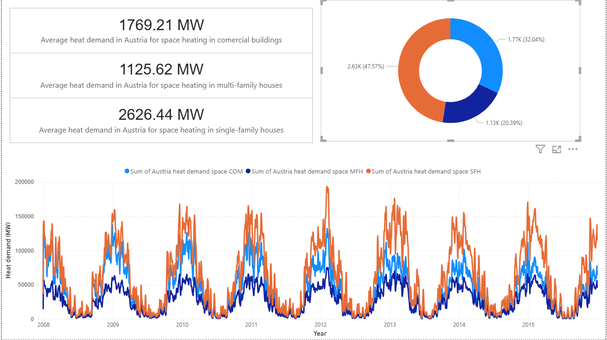
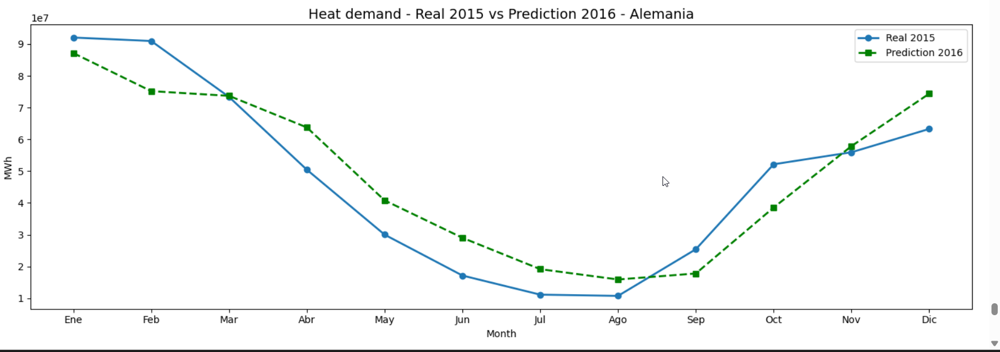

!-- Banner -->
<div align="center">

```python
print("¡Hi I'm a Junior Data Scientist 👋")
# Data Scientist | ML Engineer | Python Enthusiast
```


</div>

---

## 👤 About me

Hi, my name is Jesus Alexis, and I'm a Junior Data Scientist 🤓

I'm interested in predicting and optimizing energy consumption using data science and machine learning. I also enjoy challenging myself with different projects to learn new technologies and improve my skills.

- Location:
- 📍 México city 

---

## 🌐 Contact Networks

<div align="center">

[](https://www.linkedin.com/in/jesus-alexis-osorio-castelan-317696339)
[](mailto:jesusosoriocastelan@gmail.com)


</div>

---

## ⚡ Technology stack

<div align="center">


</div>

---

## 📌 Featured project

Thermal Energy Demand Analysis and Forecasting — Europe

This project analyzes and predicts thermal energy demand (space and water heating) across 23 European countries using hourly data from 2008 to 2015.

📊 Overview

The dataset contains detailed information about heat demand segmented by building type (commercial, multi-family, and single-family buildings) for each country. The analysis includes exploratory data analysis (EDA), time-series visualizations, and machine learning forecasting models.In the dashboard created with Power BI, the heat demand data is displayed. This is the data I will use to train and validate the prediction model.





🔍 Key Features

Exploratory Data Analysis (EDA): Statistical summaries, seasonal patterns, and monthly distributions by country and building type.
Interactive Dashboard: Developed with Streamlit for dynamic visualization of demand trends by country.
Prediction Models: Three models were compared for monthly demand forecasting:
XGBoost — R² = 0.86 ✅ Best model
LightGBM — R² = 0.76
LSTM (TensorFlow) — R² = 0.69
2016 Forecast: Iterative prediction of the complete annual thermal demand for Germany using XGBoost.
🛠️ Technologies Used

Python, Pandas, NumPy, Scikit-learn, XGBoost, LightGBM, TensorFlow, Matplotlib, Seaborn, Streamlit

🔥 Results

With the final model, I predicted the heat demand for the year 2016 in Germany.


And the final stadistics


📁 Data Source

Open Power System Data — European Thermal Load Profiles

[](https://github.com/tu-usuario/prediccion-consumo)
[](https://github.com/tu-usuario/prediccion-consumo/blob/main/notebook.ipynb)


<div align="center">

*"Los datos son el nuevo petróleo, pero solo valen si los refinas."*

</div>
